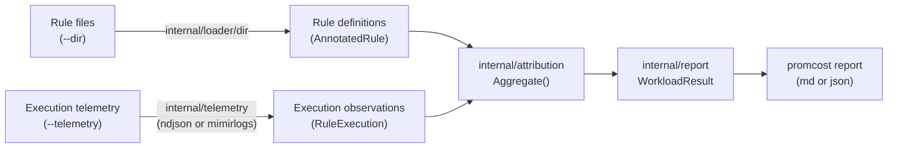
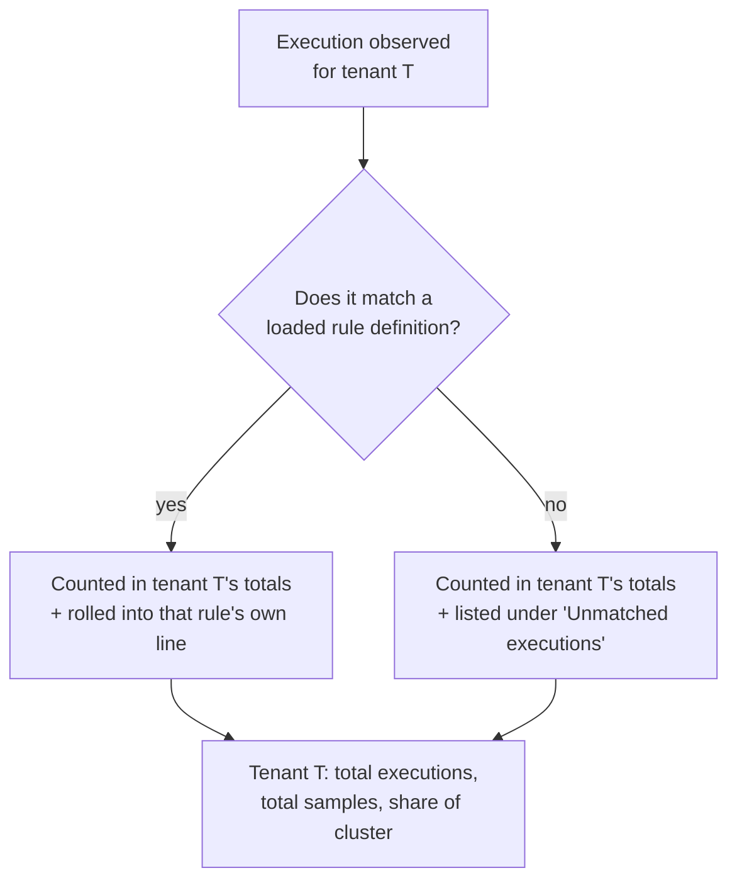
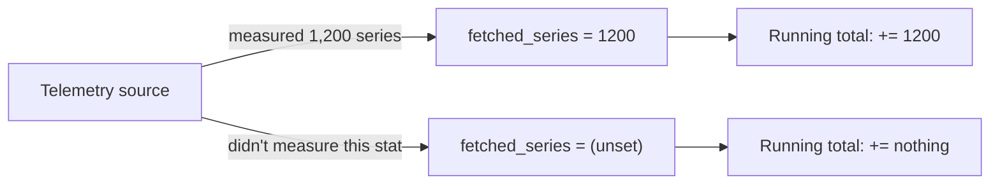
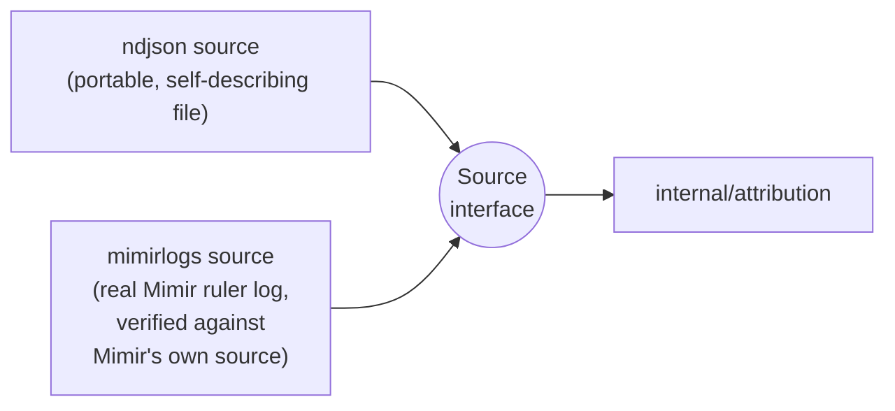
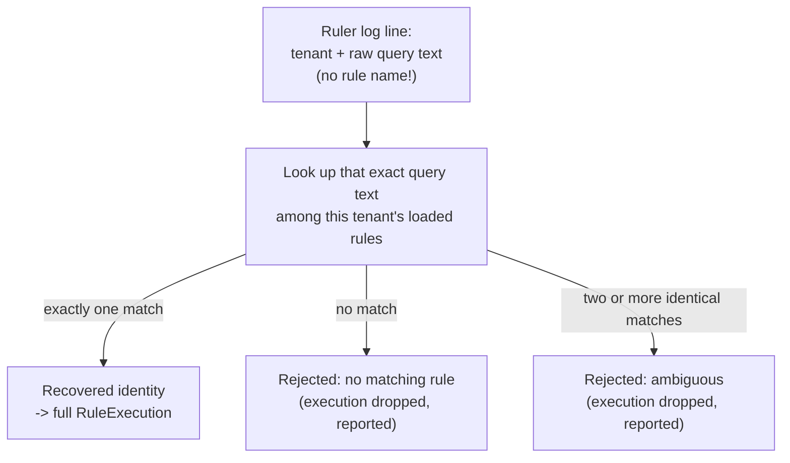

# 0001: Observed workload attribution layer

**Status:** Accepted (implemented in PR #17, closing issues #4–#8)

## Context

Up to this point, promcost only looked at rules *statically* — reading the
PromQL text and guessing whether it looked expensive (the `check` command,
the `PC-S01`–`PC-S06` checks). That's useful, but it's a guess. It can't
tell you which tenant is actually consuming the most ruler capacity right
now, or which specific rules explain it.

`PRODUCT-DIRECTION.md` reframes the product around a different question:

> Tenant X accounts for 37% of ruler workload, and these rules explain 82%
> of it.

Answering that requires real, observed data about rules actually running —
not just their PromQL text. This ADR covers the decisions behind the new
layer that makes that possible: ingesting execution telemetry, joining it
back to rule definitions, and rolling it up into a ranked report.

## The pipeline, end to end



Two independent things get loaded — the rules that *exist* (from `--dir`,
the same rule-file loader `check` already uses) and the rules that
*actually ran* (from `--telemetry`) — and a new `attribution` package joins
them together. Everything downstream of that join is new; nothing existing
was changed to build it.

## Decisions

### 1. A tenant's totals include executions it can't explain

Every observed execution belongs to a tenant. Some of those executions can
be matched back to a rule definition we loaded; some can't (the rule might
have been deleted since, or the telemetry source might disagree with
`--dir` about naming). The decision: **an execution counts toward its
tenant's totals either way.**



**Why:** a tenant's percentage share of the cluster's workload has to add
up to a consistent number regardless of how good the rule matching happens
to be. If unmatched executions were silently dropped, the report would
understate real tenants without ever saying so. If they were dropped
*without even being shown*, nobody would know the report was incomplete.
Instead they're counted, and separately listed, so the report is always
honest about what it did and didn't manage to explain.

**Trade-off:** the report has to carry an "unmatched" section, which is
extra surface area. That's the right trade for not silently under-counting.

### 2. One stable ID joins "what's defined" to "what ran"

A rule definition and a rule execution are two very different kinds of
object, produced by two completely different code paths (a YAML file
parser vs. a telemetry ingester). They need a shared, predictable way to
say "this is the same rule."

**Decision:** both sides compute a `RuleID` — tenant, namespace, group, and
rule name — the exact same mechanical way, so they're guaranteed
comparable without any fuzzy matching.

```go
type RuleID struct {
    Tenant    string
    Namespace string
    Group     string
    Name      string
}
```

**Why:** this is the simplest possible join key that's still precise. No
guessing, no similarity scoring — either the four fields match exactly, or
they don't.

### 3. "We don't know" is not the same as "it was zero"

A telemetry source might genuinely not measure every statistic. Mimir's own
ruler log, for example, never reports samples processed at all, and drops
every other number entirely when a rule is evaluated remotely instead of
locally (see decision 5). If those gaps were recorded as `0`, the report
would look precise while actually being wrong — a rule that used real
capacity would show up as free.

**Decision:** every workload statistic on a single observed execution
(duration, samples processed, fetched series/chunks/bytes) is optional. A
source that didn't measure something leaves it unset. When totals are
added up, an unset value contributes nothing to the sum — it's excluded,
not treated as zero.



**Why:** an under-counted total is a known, honest limitation. A total that
quietly includes fabricated zeros is a wrong answer that looks right. Given
the product's own stated principle ("conservative, explainable, calibrated"
over "speculative precision"), under-counting was the correct side to
default to.

**Trade-off:** every place that adds these numbers up has to remember to
skip the unset ones. That's a small, contained cost (one helper function)
against a real correctness bug — much cheaper to hold consistently now
than to discover the wrong way later.

### 4. Two ways to bring telemetry in, added in a specific order

Rule executions have to come from somewhere. The product direction says to
prefer Mimir's own logs, but "what does that log actually look like" was
an open question at the start of this work.

**Decision:** ship a simple, self-contained, portable log format first —
one JSON object per line, describing exactly what promcost's own domain
model needs — get the whole pipeline (join, aggregation, report) working
and tested against that. Only then build a second source that parses
Mimir's *real* ruler log, and only after verifying byte-for-byte what that
log actually contains by reading Mimir's own source code, not by guessing.



**Why:** a telemetry parser that's confidently wrong is worse than not
having one — it produces plausible-looking numbers nobody has reason to
distrust. Building the portable format first meant the join/aggregation/
report logic could be fully proven correct on data with a known-simple
shape, before adding the complexity (and the risk of a subtly wrong field
mapping) of a real, externally-defined log format. Both sources satisfy the
exact same interface, so nothing downstream had to change when the second
one was added.

### 5. Recovering a rule's identity from a log that doesn't have one

Mimir's real ruler query-stats log turned out to be more limited than
expected: **it has no rule name or group field at all** — only the tenant
and the raw PromQL text that was evaluated. To build a `RuleExecution` with
a usable identity, that text has to be matched back to one of the rule
definitions already loaded from `--dir`.



**Decision:** match by exact text, scoped to the tenant the log line says
it belongs to. If the text matches more than one loaded rule (two rules
that happen to share identical PromQL), refuse to pick one — reject that
line instead, with a clear reason.

**Why:** guessing which of two identical-looking rules produced an
execution would silently attribute workload to the wrong rule. That's
exactly the kind of confidently-wrong output the "conservative, explainable"
principle rules out. A dropped, explained execution is a far smaller
problem than a wrongly-attributed one.

**Trade-off:** two rules with byte-for-byte identical expressions in the
same tenant can't currently be told apart from this log alone. In practice
that's rare (it usually means genuinely duplicated rules, which is itself
worth surfacing some other way) — accepted as a known limitation rather
than solved with a heuristic.

### 6. This layer doesn't talk to the static analyzer — yet

The existing `check` command and its static checks (`PC-S01`–`PC-S06`)
were left completely untouched. The new `report` command shares no code
path with them.

**Why:** combining "what the PromQL looks like" with "what it actually
cost" is a genuinely different, harder problem — you'd want to know *which*
static signals actually predict real workload, not just assume they do.
Doing that properly is its own piece of work (tracked separately, issue
#9), and bolting it on early would have meant guessing at that relationship
instead of measuring it later once both sides exist independently and
solidly.

### 7. Every number in the report is observed, not estimated

The report never converts anything into currency, and its output is
explicitly labeled `(observed)`.

**Why:** this mirrors the product's own stated order of operations — get
trustworthy, real measurements first; only convert to cost once there's a
calibrated model to convert with. Shipping made-up currency figures before
that model exists would create a false sense of precision the product
explicitly wants to avoid.

## Consequences

- The report is currently only as complete as the telemetry it's given —
  if nothing is scraping/logging query stats, `report` has nothing to say.
  That's expected at this stage; it's an ingestion problem, not an
  attribution one.
- Adding a third telemetry source (e.g. a query-frontend log, or Mimir's
  query-stats HTTP API) means writing one more implementation of the same
  `Source` interface — the join and aggregation logic don't need to change.
- Joining this layer with the static analyzer (issue #9) is the natural
  next step, and is now possible to build on solid ground: both sides
  already produce a stable, independently-tested `RuleID`-keyed view of the
  world.

## References

- `PRODUCT-DIRECTION.md` — the product thesis this implements
- `docs/runtime-telemetry-notes.md` — the telemetry-source research this
  was built on
- GitHub issues #4–#8 (this ADR), #9 (the follow-up join with static
  analysis)
