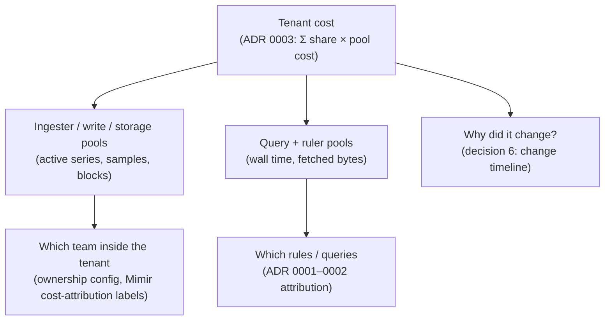

# 0004: Pivoting to end-to-end cost allocation — what we take, what we change, and in what order

**Status:** Proposed

## Context

Up to now promcost has answered a platform-team question:

> Tenant X accounts for 37% of ruler workload, and these rules explain 82%
> of it.

A design conversation
([`docs/pivot-mimir-cost-attribution-conversation.md`](../pivot-mimir-cost-attribution-conversation.md))
and the collection-layer plan that came out of it
([`docs/pivot-mimir-collection-layer-design.md`](../pivot-mimir-collection-layer-design.md))
propose widening this into an end-to-end FinOps product. Tenant-level
chargeback comes first, fed by a per-cluster agent writing to BigQuery, with
change-event capture, anomaly alerts, budgets, and integrations on top.

The *question* is not new. `PRODUCT-DIRECTION.md` Milestones F–H already aim
at tenant/team economics. What the pivot actually changes is four things,
and they are why this needs an ADR rather than a roadmap edit:

| | before | after the pivot |
|---|---|---|
| **order** | rule-level workload first, economics last (Milestone H) | tenant-level cost first, rules become the drill-down |
| **architecture** | a CLI you run once, no daemon (v0 non-goal; ADR 0002 decision 4) | an always-on per-cluster agent and a central store |
| **buyer** | platform / SRE team | platform lead *and* FinOps / finance, who need defensible, immutable numbers |
| **non-goals** | no daemon, no PodMonitor prediction, "don't lead with euros", "not a billing system" | all four reversed |

This ADR records which parts of the pivot we adopt, which we change, and the
order to build them in. It builds on ADR 0003 (the pool→driver cost model,
PR #26, still Proposed) and does not restate it.

---

## What we checked

The pivot documents were written from memory. Before relying on them, their
concrete claims were checked against `dev/mimir-local` (Mimir 3.2.0) on
2026-09-17, by grepping `/metrics` and `mimir -help-all`.

| claim in the pivot docs | what the rig says |
|---|---|
| `cortex_ingester_ingested_samples_total{user}` | ✅ exists |
| `cortex_distributor_received_samples_total{user}` | ✅ exists |
| `cortex_query_frontend_queries_total{user}` | ✅ exists (also carries `op`) |
| `cortex_ruler_queries_total{user}`, `cortex_ruler_queries_failed_total{user}` | ✅ exist |
| `cortex_query_scheduler_queue_duration_seconds{user}` | ✅ exists (histogram) |
| `cortex_ingester_memory_series{user}` as the active-series signal | ❌ this metric has **no** `user` label. The per-tenant one is `cortex_ingester_active_series{user}` |
| `cortex_ruler_query_duration_seconds{user}` | ❌ does not exist. The real one is `cortex_ruler_query_seconds_total{user}` |
| `cortex_ruler_rules{user, rule_type}` | ❌ does not exist. The nearest is `cortex_prometheus_rule_group_rules{user, rule_group}`, which has no recording/alerting split |
| per-tenant compactor bytes (`compactor_bytes_processed`) | ❌ no `cortex_compactor_*` metric carries `user`. ADR 0003 uses `cortex_bucket_index_estimated_compaction_jobs` as a low-confidence proxy instead |
| "`query_stats_enabled: true` is the default" | ⚠️ half right. `-query-frontend.query-stats-enabled` defaults to **true**. `-ruler.query-stats-enabled` defaults to **false**, and ruler logs are what ADR 0001 depends on |
| "querier and ruler emit `query stats` lines" | ⚠️ the detailed lines come from the **query-frontend** and the ruler, not the querier. The ruler's line has no rule name and no `samples_processed` (ADR 0001 decision 5; `docs/investigation-ruler-remote-query-frontend.md`) |

Two problems in the pivot's reasoning, beyond metric names:

**The combined query in the conversation doc (§2) returns nothing.**
`rate(cortex_query_frontend_queries_total[1h]) + rate(cortex_ruler_queries_total[1h])`
only matches series with identical label sets, and the frontend metric
carries `op` while the ruler one does not. It needs
`sum by (user) (...) + sum by (user) (...)`. Even then a tenant absent from
either side drops out of the result instead of counting as zero.

**It double-counts under remote ruler evaluation.** With
`-ruler.query-frontend.address` set, every rule evaluation is also a
frontend query. Adding the two counts counts that work twice.
`docs/runtime-telemetry-notes.md` already warns about this.

The row-count estimate is also inconsistent: the conversation doc says 72k
rows/day for 250 tenants, the collection doc says 72k for 50 (it's ~14k).
That's per cluster either way, and small either way.

One finding works *for* the pivot. **Mimir 3.2.0 ships experimental native
cost attribution:** `-validation.cost-attribution-trackers` (JSON, e.g.
`{"by-team":{"labels":[{"input":"team"}]}}`),
`-validation.max-cost-attribution-cardinality` (default 2000), and
`-cost-attribution.registry-path` (metrics are exposed only if it is set).
It attributes samples and active series *inside* a tenant by a label. That
is exactly the "tenant ≠ team" problem the conversation doc lists as its
messiest risk. We only confirmed that the flags exist, not their behaviour.

---

## Decisions

### 1. Reposition as cost allocation for self-hosted Mimir; rules become the "why" layer

Adopted. The headline becomes:

> `analytics` is costing you the equivalent of 5 of your 8 ingesters and
> 30% of query capacity, and here's what's driving it.

Rule-level attribution (ADRs 0001–0002) is not discarded. It is the only
thing that can tell a tenant *what to change*, so it becomes the drill-down
under the ruler and query pools of ADR 0003's model.

### 2. Allocate by pool and driver; do not fit weights by regression

The conversation doc (§6) proposes pointing the product at a billing export
and fitting per-signal weights so the totals match actual spend. **Rejected.**

- Series, samples, and query counts move together, so a regression over a
  handful of clusters produces unstable, collinear weights that change
  sign between months.
- A fitted weight can't be explained to a team lead. "Your share of
  ingester memory is 62%" can.

**Instead we use ADR 0003's model.** Each component pool has a cost, and
that cost is split by the driver that physically makes the pool grow.
Pool costs come from one of the following, in order of preference:

1. the operator inventory block ADR 0003 decision 3 already defines
2. **optionally**, an adapter over OpenCost/Kubecost, which already prices
   pods. We should not rebuild node-level cost collection, which the
   collection doc's "capture actual CPU/memory costs per cluster node"
   implies.
3. a cloud billing export, as a later adapter

Billing exports are still valuable, but to **check** the model (does the
sum of pools reconcile with the invoice?), not to fit it.

### 3. Build order: showback in the CLI before any agent

The collection doc starts with the agent and warehouse. We invert that:

| step | what | new infrastructure |
|---|---|---|
| 0 | Validate the buyer with 3–5 self-hosted Mimir teams: who wants per-tenant cost, what do they use today, will they share a bill? | none |
| 1 | Tenant showback in `promcost report`: ADR 0003 pools (starting with pool 1), `/distributor/all_user_stats`, an assumption trail per figure | none — a URL and a config block |
| 2 | Persist daily rollups through a pluggable sink (decision 4), once a partner needs history beyond Mimir retention | a sink; still runnable as a CronJob |
| 3 | Change timeline (decision 6), query-frontend telemetry source, spike detection against the stored baseline | small long-running watcher |
| 4 | Budgets, Slack digest, per-team views | — |
| later | Pre-flight PodMonitor estimation, Backstage/Jira, admission webhook, UI | — |

Step 1 is cheap, can be demoed, and reuses the existing attribution engine.
It also tests the part most likely to be wrong (the cost model) before we
invest in the part least likely to be wrong (moving rows around).

### 4. Customer-owned warehouse, behind a sink interface — not BigQuery-only

Adopted from the collection doc:

- store raw 5-minute observations and compute rollups in SQL views, so the
  cost model can be changed retroactively
- keep the data in the **customer's** warehouse, not a promcost-hosted
  service, because it makes the security and operations conversation easy

Changed:

- **Put a `Sink` interface in front of the store.** BigQuery is one
  implementation, not the architecture. Requiring GCP rules out AWS-hosted
  design partners. Build a local file sink (NDJSON/Parquet, queryable with
  DuckDB) first so development and tests need no cloud. Add BigQuery and
  ClickHouse when a partner needs them.
- **For BigQuery, use load jobs or the Storage Write API, not legacy
  streaming inserts.** For a 5-minute batch job, legacy inserts cost more
  and add nothing.
- **Monthly chargeback records are write-once.** A closed month is never
  recomputed in place. Rerunning it under a new cost model creates a new
  version with its own model identifier. This is what "immutable records
  for finance" has to mean if raw data can be reprocessed.

**How this relates to ADR 0002 decision 3** (publish derived per-rule stats
back into Mimir via remote-write): the two coexist. Operational series that
people want to graph and alert on still belong in Mimir. The chargeback
ledger does not. It has to outlive Mimir retention and cluster rebuilds,
which a Mimir tenant can't guarantee.

### 5. The per-cluster agent: adopted, but only when step 2 needs it

This **conditionally supersedes ADR 0002 decision 4** ("no collector service
yet"). That decision said to revisit "only if someone needs a retention
window Mimir can't give them". Chargeback is exactly that case, but only
once a real partner asks for it.

When it is built, it keeps the collection doc's shape:

- one agent per cluster
- outbound-only network access
- per-cluster Workload Identity (or IRSA on AWS)
- a single Go binary with a `CronJob` mode for scraping and a `Deployment`
  mode for watching

It is a thin scheduler around the same `internal/` packages the CLI uses,
not a second codebase. **Anything the agent reports must be producible by a
one-off `promcost report` run.**

### 6. Change timeline: source-agnostic, starting from the ruler API

Adopted as the main differentiator: explaining *why* a tenant's cost moved,
not just that it did.

Changed: the conversation doc watches `PrometheusRule` CRDs. Many Mimir
setups never use them for Mimir rules; they push with `mimirtool rules sync`
or the ruler API directly, and a CRD watcher would see only part of the
changes. So:

- **Rule changes come from diffing periodic ruler API snapshots**
  (`internal/loader/rulerapi` already fetches them). This catches every
  change regardless of how it was deployed, and it is exactly the "when did
  this definition reach Mimir" timeline ADR 0002 decision 3 said nobody
  records.
- **CRD watching** (`PrometheusRule`, `PodMonitor`, `ServiceMonitor`) is an
  enrichment. It adds who/which repo and covers scrape-target changes the
  ruler API can't see.
- **Store diffs, not just state**, as the conversation doc says.

### 7. Tenant → team mapping: explicit config first, native labels where available

`X-Scope-OrgID` often doesn't map to one team. Two mechanisms, together:

- the explicit `ownership` block `PRODUCT-DIRECTION.md` Milestone F already
  sketches, for tenant-level mapping
- Mimir's native cost-attribution trackers (Context), for splitting
  ingestion-side pools *inside* a tenant. This must be verified on the rig
  before we design around it: output metric names, overflow behaviour, and
  whether it covers anything on the query path (the flag help only mentions
  samples and active series)

### 8. Explicitly out of scope for now

- **Writing limits back into Mimir** (`max_global_series_per_user` as budget
  enforcement). This makes promcost a writer to production runtime config,
  a much bigger trust ask than read-only reporting. Revisit after budgets
  have been advisory for a while.
- **Admission webhook for pre-flight estimates.** If pre-flight is built,
  start with a CLI that scrapes the candidate target's `/metrics` and counts
  series before the `PodMonitor` is applied. That measures the series
  instead of guessing them from label selectors.
- **UI, Backstage plugin, Jira integration.** Push data to where people
  already look (a Slack digest, a Grafana dashboard over the warehouse)
  before building a place for them to go.
- **One "query cost unit" priced separately for ruler vs. dashboard
  queries.** Agreed with the conversation doc: one pool with a per-type
  drill-down.

---

## Consequences

- **The v0 non-goals in `AGENTS.md` and `PRODUCT-DIRECTION.md` become
  stale** as soon as this is accepted: no daemon, no PodMonitor prediction,
  "not a billing system", "don't lead with euros". Both files need updating
  in the same change that accepts this ADR, or agents will keep enforcing
  the old scope. ADR 0003 decision 2 (resources first, currency opt-in)
  keeps the spirit of "don't lead with euros".
- **The tool gains a stateful component and a config surface.** Operators
  will need to supply an inventory, an ownership map, and eventually sink
  credentials. Step 1 must work with a partial inventory, or adoption stalls
  before anyone sees a number.
- **The claims get more falsifiable.** "What each tenant costs" invites
  "prove it" from finance. The assumption trail (ADR 0003 decision 4),
  versioned monthly records (decision 4), and reconciling against a bill
  (decision 2) exist to answer that.
- **ADR 0003's calibration prerequisite becomes more urgent.** It notes that
  the monolithic rig can't separate per-component resource use. Chargeback
  to a paying buyer shouldn't ship pools marked "low confidence" as if they
  were facts.
- **The pivot documents stay as historical input, not specification.** Their
  metric names and defaults are corrected above; code should follow this
  ADR, not them.

## References

- [`docs/pivot-mimir-cost-attribution-conversation.md`](../pivot-mimir-cost-attribution-conversation.md)
  — the design conversation this evaluates
- [`docs/pivot-mimir-collection-layer-design.md`](../pivot-mimir-collection-layer-design.md)
  — the agent/BigQuery plan this re-sequences
- [ADR 0001](0001-observed-workload-attribution-layer.md) — rule-level
  attribution, now the drill-down layer
- [ADR 0002](0002-where-workload-evidence-comes-from.md) — source ownership;
  decision 4 conditionally superseded by decision 5 here, decision 3
  extended by decisions 4 and 6
- ADR 0003 (PR #26, `docs/adr/0003-cost-model-pool-driver-mappings.md`) —
  the pool→driver cost model this adopts
- `PRODUCT-DIRECTION.md` — Milestones F–H, pulled forward by this ADR
- `docs/runtime-telemetry-notes.md` — the remote-evaluation double-counting
  warning
- Measurements: `dev/mimir-local`, Mimir 3.2.0 (rev `9ab70ccf`), `/metrics`
  and `mimir -help-all`, 2026-09-17
