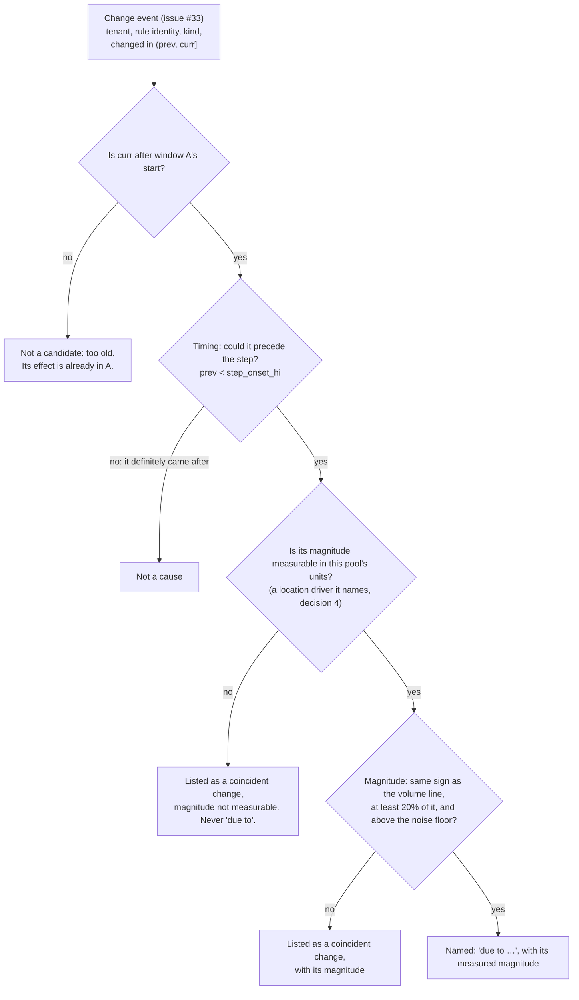

# 0005: Cost change attribution — delta, decomposition, causes

**Status:** Proposed

## Context

ADR 0003 answers *"what does each tenant cost over one window"*. It
deliberately stops there. The sentence a platform lead actually brings to a
meeting is different:

> `analytics`' cost share is up 4 points since yesterday, driven by rules A,
> B and C.

That sentence makes three separate claims, and each can be wrong in its own
way:

1. **A delta** — something moved between two windows. That is only true if
   the two windows are comparable at all.
2. **A decomposition** — *whose* doing the move was. A tenant's share of a
   pool moves when the tenant grows, but also when *other* tenants shrink,
   and its cost moves when the operator scales the pool. Subtracting
   yesterday's figure from today's blends those three into one number
   nobody can act on.
3. **A cause** — *which change* did it. No tenant-level number can name a
   cause, and naming one on timing alone is the classic way to be
   confidently wrong.

ADR 0003's amendments already fixed two pieces of this: how each driver is
aggregated over a window (counters by `increase()`, gauges by an average),
and what happens to a share when the measured set changes between windows
(decision 5 [A]). ADR 0003 also set the rule for cross-pool totals under a
partial inventory. This ADR builds the rest of the delta layer on top of
those, and does not restate them.

The prior art is covered in ADR 0003: three of the 14 `mimir-top-tenants`
panels compute growth with `@ start()` / `@ end()`, per axis, as a
leaderboard, in resource units, with no cause. This ADR covers what those
panels leave out: how much a change cost, whose doing it was, and what
caused it.

**Two inputs are being built alongside this ADR, and it is written against
their shapes:**

- **Change events** from ruler-API snapshot diffs (issue #33, ADR 0004
  decision 6). A snapshot diff cannot say *when* between two polls a rule
  changed, only that it did. So each event carries an **interval**: the
  change reached Mimir in `(prev_snapshot, curr_snapshot]`. The evidence
  bar below uses that interval as given and never collapses it to a point.
- **The PromQL client** in `internal/promapi` (PR #40). The sub-tenant
  driver queries below go through it. `Meter.SeriesCount`, which ADR 0003
  and issue #37 name as the home for `count({__name__="<record>"})`, is
  removed by PR #42 and is not used here.

---

## Decisions

### 1. Windows: equal length, aligned, complete, and covered, or not compared

A delta compares two **windows**, *A* (before) and *B* (after).

| property | rule | default |
|---|---|---|
| **duration** | A and B are always the same length | 1 day; 7 days selectable |
| **adjacency** | B is the most recent *complete* window; A is the one immediately before it | day over day |
| **alignment** | half-open `[start, end)`, aligned to calendar boundaries | midnight; Monday 00:00 for weeks |
| **timezone** | an IANA zone, used only to place boundaries | `UTC` |
| **completeness** | a window still in progress is never used; `end` must be at least one ingestion-lag allowance in the past | 15 minutes |
| **resolution** | gauge averages and coverage are evaluated as subqueries at a fixed step | 5 minutes (288 points/day, 2,016/week) |
| **coverage** | the fraction of expected steps at which the driver has data | at least **90%** in *both* windows |

**What a data gap does.** Coverage is measured, never assumed. For each
pool, it is the fraction of steps in the window at which the pool's total
driver has a sample. For each tenant, it is the same fraction computed for
that tenant's driver alone:

```
coverage(pool, W) = count_over_time( (sum(<driver>))[W:5m] ) / (W / 5m)
```

- **A pool below 90% in either window is incomparable.** It is reported as
  *"not compared: coverage 71% (A) / 99% (B), below 90%"*. It is never
  compared at reduced confidence, and it never has its gap interpolated.
  ADR 0002 Finding 2 is why: the rig's scraper was dead for 8 days, and
  every number from that period looked plausible.
- **A tenant below 90% in a window counts as not measured in that window.**
  Its share move is then a *membership* effect (decision 2), not a change
  in the tenant's own volume.

**Why fixed calendar windows rather than rolling ones.** A digest that says
"yesterday" has to mean the same interval for everyone reading it, on every
run, and a rerun has to reproduce the same figure. That is also what ADR
0004 decision 4's write-once monthly records need. Rolling windows move
with every run, so no two runs are measuring the same thing.

**Daylight saving.** When the timezone is not UTC, one day a year is 23
hours and one is 25. Counter drivers are converted to a per-second rate over
their window (`increase / window seconds`) before anything else happens.
Otherwise a 25-hour day reads as roughly 4% growth. Gauge averages are
already independent of window length. Shares are unaffected either way.

**Window aggregates, never end points.** A delta is always the difference
of two window aggregates. It is never the difference of two instant
queries at the window ends. Deploys and scrape churn make instant
active-series counts jumpy, and averaging over the window is the main
defence against that (decision 6 is the other).

**No sink is required.** Every input here is a meta-monitoring metric, so
window A is just a range query further back, bounded by Mimir retention
(ADR 0003 [A]). The exceptions are the snapshot-only sources in decision 4,
which need to have been captured at the time.

### 2. Decompose every change into volume, mix and price, chained and exactly additive

For one tenant *t* in one pool:

```
d = t's own driver (window aggregate, per decision 1)
O = Σ driver over the other tenants measured in BOTH windows
M = Σ driver over tenants measured in only ONE window (entrants in B, leavers in A)
P = pool cost: replicas, or currency when priced (ADR 0003 decision 2)

share = d / (d + O + M)
cost  = share × P
```

The change from A to B is split by **changing one factor at a time, in a
fixed order**. Each step's effect is measured with every factor not yet
changed held at its window-A value:

| step | line | what it isolates | effect on share | effect on cost |
|---|---|---|---|---|
| 1 | **volume** | *t*'s own driver changed | `d_B/(d_B+O_A+M_A) − s_A` | `P_A × Δ` |
| 2 | **mix** | other tenants' drivers changed | `d_B/(d_B+O_B+M_A) − previous` | `P_A × Δ` |
| 3 | **membership** | a tenant entered or left the measured set | `s_B − previous` | `P_A × Δ` |
| 4 | **price** | the pool's cost changed (the operator scaled it, or its unit price changed) | none | `s_B × (P_B − P_A)` |

Each step's value is subtracted from the next one's, so the sum telescopes:
**the lines add up exactly to `s_B − s_A` and `cost_B − cost_A`, with no
residual.** Membership is shown only when it is non-zero. Otherwise a share
change has two lines (volume and mix) and a cost change has three (volume,
mix and price). The report shows the lines, **never just the sum**.

**Why the order is volume → mix → membership → price.** A chained
decomposition depends on its order. The interaction between two effects
lands in whichever of them comes later. This order puts every interaction
into the line the tenant *does not* control:

- the tenant's own volume line is valued against an unchanged world: the
  others as they were, and yesterday's price;
- the effect of the operator scaling the pool, including the part that
  compounds with the tenant's share change, is charged to the price line,
  i.e. to the operator's decision.

The result understates what the tenant did rather than overstating it. That
is the same conservative direction as ADR 0001 decision 3. The order is
fixed, not configurable, and the report says which order it used.

**Rejected: Shapley averaging over all orderings.** It is also exactly
additive, and it does not depend on order. But with four factors it
averages 24 orderings. Nobody can check the resulting line against their
own console with a calculator, and ADR 0003 decision 4 requires that every
figure can be checked that way.

**Membership, and ADR 0003 decision 5 [A].** That amendment says a
comparison is computed *over the tenants measured in both windows*, and
that entrants and leavers are reported as their own line item. This ADR
keeps the intent: a membership effect is never folded into another
tenant's delta. It changes the mechanism, from excluding those tenants to
isolating them in step 3. That keeps two properties that exclusion loses:

- the before/after pair equals the two snapshot reports;
- the cost lines still add up to the pool's real cost. With exclusion, the
  stable set's shares sum to 100% while an entrant holds part of the pool,
  so the stable set is over-charged.

This refinement needs owner confirmation (see Consequences).

**Across pools.** A tenant's cross-pool change is the per-pool lines summed
line by line. It stays exactly additive, because every pool is. See
decision 7 for which cross-pool figures may be rendered at all.

**Invariants the implementation must test.** Summed over all tenants in a
pool, the volume + mix + membership share lines are exactly 0 (shares sum to
100% in both windows), and the price lines sum to exactly `P_B − P_A`. Both
are cheap unit tests that catch a wrong denominator immediately.

#### Worked example

Pool 1 (ingester memory), with illustrative figures shaped like the rig's
tenants. The operator runs 8 ingesters at €300 per ingester-month on Monday
and scales to 10 on Tuesday.

| tenant | active series, Mon (A) | active series, Tue (B) |
|---|---|---|
| analytics | 12,000 | 13,000 |
| infra | 9,000 | 8,000 |
| payments | 3,500 | 3,500 |
| platform | 500 | 500 |
| **total** | **25,000** | **25,000** |

For `analytics`, `O_A` = 13,000, `O_B` = 12,000 and `M` = 0:

```
s_A          = 12,000 / (12,000 + 13,000) = 48.0%
after step 1 = 13,000 / (13,000 + 13,000) = 50.0%     volume  +2.0pp
after step 2 = 13,000 / (13,000 + 12,000) = 52.0%     mix     +2.0pp
s_B          = 52.0%  (no entrants/leavers)            membership 0 — not shown

cost_A = 48.0% × 8 ingesters  = 3.84 ingesters = €1,152/month
cost_B = 52.0% × 10 ingesters = 5.20 ingesters = €1,560/month

volume  = 8  × (50.0% − 48.0%)  = 0.16 ingesters = €48
mix     = 8  × (52.0% − 50.0%)  = 0.16 ingesters = €48
price   = 52.0% × (10 − 8)      = 1.04 ingesters = €312
                                  ──────────────   ────
total                             1.36 ingesters   €408   = 5.20 − 3.84 ✓  = 1,560 − 1,152 ✓
```

The naive readings of the same data are *"analytics' share is up 4 points"*
and *"analytics costs 35% more"*. Both are true, and neither is actionable.
The decomposition says:

- the pool total did not move at all (25,000 → 25,000);
- half of the share gain is `infra` shrinking;
- three quarters of the cost increase (€312 of €408) is the operator's
  decision to add two ingesters.

`analytics`' own growth accounts for €48 of the €408.

The order matters by exactly the interaction term. With price first, the
lines would read €60 / €60 / €288. The €24 difference is `Δshare × ΔP` =
4.0% × 2 ingesters × €300. Under the chosen order it goes to the operator's
line.

**Price needs per-window pool costs.** The inventory block in PR #40 has no
dates. With a single undated inventory, P_A = P_B by construction, and the
report says *"price held constant: inventory has no history"* instead of
printing a zero price line as if it had been measured. Showing a price line
needs an effective-dated inventory (`effective_from` per pool entry), or
replica counts measured per window. That is an implementation follow-up,
not a blocker.

### 3. Units: percentage points for shares, percent for amounts, always the pair

| quantity | unit of change | example |
|---|---|---|
| a share | **percentage points** | `48.0% → 52.0% (+4.0pp)` |
| an absolute amount (resources or currency) | **percent**, plus the absolute delta | `3.84 → 5.20 ingesters (+35.4%, +1.36)` |
| a decomposition line | the absolute unit of its parent | `volume +2.0pp`, `price +1.04 ingesters (€312)` |

- **A share change is never written in percent.** Going from 48% to 52% is
  "+4.0pp" and never "+8.3%". The two readings differ by a factor of 12
  here, and a reader cannot tell which one was meant.
- **The before/after pair is always printed.** A delta without its pair
  hides the scale: +4pp on 1% is not the same event as +4pp on 50%.
- **A change from zero has no percent.** It is shown as *"new: 0 → 1,200
  series"*, never as "+∞%" or omitted.
- **Resources first, currency alongside.** This follows ADR 0003 decision
  2. The price line says what changed, e.g. *"pool scaled 8 → 10
  ingesters"* or *"unit price €300 → €330"*, so it can be checked against
  the inventory.
- **Displayed lines add up to the displayed total.** Computation is exact.
  Each line is then rounded to display precision (one decimal for pp,
  otherwise the pool's unit precision) using largest-remainder rounding, so
  the printed lines sum to the printed total. JSON output carries the
  unrounded values.

### 4. Tenant-level numbers locate a change; only a sub-tenant driver can name a cause

Decision 2 says which *effect* moved a tenant's cost. It cannot say
*why*. Nothing at tenant level can: an active-series count or a samples
rate is one scalar, and a scalar has no parts. Explaining a volume line
needs a driver **below** the tenant that carries a name. The report has
three levels, and each is only allowed to say what its evidence supports:

| level | answers | example | evidence |
|---|---|---|---|
| **effect** | whose doing it was | *volume +€48, mix +€48, price +€312* | decision 2, tenant-level drivers |
| **location** | where inside the tenant the volume moved | *output of `job:requests:rate5m` +700 series* | a named sub-tenant driver, measured in both windows |
| **cause** | which change did it | *due to rule group `analytics/sessions` changed between 09:05 and 09:10* | a change event that passes decision 5's bar |

Candidate sub-tenant drivers, in order of what they can name:

| source | names | history | pools | status |
|---|---|---|---|---|
| **Recording-rule output**: `count({__name__="<record>"})` per rule, as a window average through `internal/promapi` (issue #37) | **a rule** | yes: it is a range query over the tenant's own data | 1 (series); 2 (series ÷ group interval = samples/s) | the only source that names a rule; no other tool can do this (ADR 0003 [A]) |
| **Active-series custom trackers** (`cortex_ingester_active_series_custom_tracker{user,name}`), and Mimir's cost-attribution trackers (ADR 0004) | an operator-defined slice (team, app, label value) | yes: they are metrics | 1, 2 | labels, not rules: rule output lands under whatever labels the expression produced |
| **Mimir cardinality API** (`/api/v1/cardinality/label_values` on `__name__`, `/api/v1/cardinality/active_series`) | a metric name | **no**: current head only | 1 | a snapshot, like the ruler API; only comparable if captured at both ends; not yet verified on the rig |
| **Per-rule evaluation cost**: ruler API `evaluationTime`, the query-stats log (ADRs 0001–0002) | a rule | log: only if captured; API: snapshot only | 7 (ruler CPU), 6 | the existing drill-down layer |

Three rules follow:

- **`RuleIngestionRate` vs `APIIngestionRate` is corroboration, never a
  location or a cause.** It is a two-way split of one scalar. It can
  support *"the growth came from rule output"*, but it can never say which
  rule (ADR 0003 [A]). `/distributor/all_user_stats` is also an
  instant-only endpoint, so the split can only be compared if both windows
  were captured. Where it appears, it is an annotation on a location line.
- **Recording-rule output is counted after deduplication.** A query-path
  `count()` sees each series once, so no replication divisor applies.
  Pool 1's ingester metric is divided by the replication factor (ADR 0003
  [A]), and after that the two are in the same units and can be compared.
- **The query must run as the tenant.** Pool drivers are
  meta-monitoring metrics, read as the metrics tenant. A rule's output
  series live in the *evaluating tenant's* own storage, so this query needs
  `X-Scope-OrgID` for each tenant being explained. That is a new
  permission, and the report must degrade to effect-level output when the
  permission is missing, not fail.

Location lines are measurement, not inference. They may be shown without
any change event (*"the growth is in `job:requests:rate5m`'s output"*). The
word **"due to"** is reserved for decision 5.

### 5. The evidence bar for "due to": timing *and* magnitude, remainder unexplained

A change event is named as the cause of a volume line only if it passes
**both** tests. Passing the timing test alone is coincidence.



**Timing, using the event interval as given.** The event happened
somewhere in `(prev, curr]`. The step change in the tenant's driver also
has an interval, `[onset_lo, onset_hi]`: the first step at which the
driver crosses halfway from its A level to its B level, at the 5-minute
resolution of decision 1. For a gradual ramp, the onset interval is the
whole span from A's end to B's end, and timing then eliminates almost
nothing, so magnitude does the work. The test is that the event **could**
precede the step: `prev < onset_hi`. An interval that straddles the onset
passes. An event that definitely came after the step fails. The report
prints both intervals (*"changed between 09:05 and 09:10 UTC; step began
09:05–09:10"*), so it never claims more precision than the snapshot poll
has.

**Magnitude, measured rather than modelled.** An event's *predicted
magnitude* is the change, between windows A and B, in the location driver
the event names. For a recording rule, that is its output series:

- an added rule: its B average, since A was 0;
- a removed rule: minus its A average;
- a changed rule: its B average minus its A average;
- a renamed `record:`: a removal plus an addition.

"Predicted" means the number comes from the event's own driver,
independently of the tenant-level delta it is tested against. It does not
mean a forecast. Events from one snapshot diff in the same rule group are
tested as **one** event. A group change of 14 rules that together explain
60% is named, even though no single rule reaches 20%.

**The remainder is reported, never spread.**

- `unexplained = volume line − Σ named magnitudes`. It is printed as its
  own line, in the same units.
- Named magnitudes are printed as measured. They are never scaled to fit.
  If they overshoot (a rule added +2,000 series while the tenant grew
  +1,000), the unexplained line is negative (*"offsetting changes,
  unexplained: −1,000"*). The overshoot is not trimmed from the named
  causes.
- Only volume lines get causes. A mix line is explained by *other*
  tenants' volume lines, which are named by tenant (*"infra −1,000
  series"*) and not re-derived. A price line is explained by the inventory
  change itself.
- An event that fails the bar is still listed, as a *coincident change*
  with its magnitude when known. A reader can see what was ruled out, and
  why.

**What the event needs to carry.** This ADR consumes only: tenant, rule
identity (ADR 0001's `RuleID`), rule type, `record:` name before/after,
kind (added/removed/changed), and the `(prev, curr]` interval. If #33 lands
a different shape, the requirement is the interval semantics: an event
reported as a point in time would make the timing test claim more than the
poll can know.

### 6. A noise floor, so the report is not a spam generator

Day-over-day active-series deltas are dominated by deploys (pod churn
creates series under new label values) and scrape churn. With no floor,
every tenant gets a change report every day. A tenant's change in a pool
is reported only if it clears **all** of:

| test | default | why |
|---|---|---|
| **relative** | `\|Δcost\| ≥ 5%` of `cost_A` (`\|Δshare\| ≥ 1.0pp` when the pool is unpriced) | ignores the day-to-day wobble of a large tenant |
| **absolute** | `\|Δcost\| ≥ 0.5%` of the pool | a tiny tenant doubling is not news to the operator |
| **against its own history** | `\|Δ\| ≥ 3 ×` the median absolute delta of this tenant's previous 14 windows, when that history exists | a tenant that normally churns ±8% is not flagged at +6% |

The history test needs no sink: it is 14 more windows of the same range
queries, within retention. When fewer than 14 comparable windows exist, the
test is skipped and the report says so.

- **A reported change always shows all its lines.** The floor gates
  whether a tenant is reported, never which of its decomposition lines are
  shown.
- **What falls below the floor is counted, not dropped.** The report closes
  with *"12 tenants changed below the noise floor (net +0.3pp of pool 1)"*.
  This keeps the exhaustive principle of ADR 0003 decision 1.
- **The floor applies to locations and causes as well.** A location or
  cause line smaller than the absolute floor is folded into "unexplained".

The thresholds are defaults in `promcost.yaml`, and the report names the
thresholds it applied.

### 7. Under a partial inventory, "40% of all Mimir cost" is never said

ADR 0003 [A] already rules that a cross-pool total names its own coverage.
Deltas make that stricter in two ways:

- **"X% of all Mimir cost" is never rendered.** The denominator can only
  contain priced pools, so the claim is not true. The reportable form names
  the priced set. The *priced fraction* is printed as a number
  (*"40% of the 78% of platform cost we can price"*) only when the operator
  also supplies a platform total, such as the monthly bill, as its
  denominator. Without that total, nothing measures the unpriced
  remainder, and the priced pools are named instead: *"40% of priced cost
  (ingester memory, write path, ruler; storage and compactor not
  costed)"*. This makes ADR 0003's *"computed from the operator's
  inventory"* concrete.
- **A cross-pool share is not given a delta.** A cross-pool share changes
  when pool prices change *relative to each other*, even if every
  tenant's share of every pool stands still. That is a fourth effect,
  which decision 2 does not isolate. So a delta view renders per-pool
  share deltas (pp) and **absolute** cross-pool cost deltas (the sum of
  per-pool lines), and never *"40% → 44% of priced cost"*.
- **The priced set must be the same in both windows.** A pool that is
  priced in one window only is a membership effect at pool level (ADR 0003
  decision 5 [A] item 3). It is reported as its own line and is not
  included in the cross-pool sum.

---

## What the report looks like

Illustrative, for the worked example, with an event from issue #33:

```
analytics · ingester memory · Tue 2026-09-15 vs Mon 2026-09-14 (UTC, 1d)
coverage 99.8% / 99.6% · order: volume → mix → membership → price

  share   48.0% → 52.0%                        +4.0pp
    volume   analytics' own series             +2.0pp
    mix      others' series (infra −1,000)     +2.0pp

  cost    3.84 → 5.20 ingesters (€1,152 → €1,560/mo)   +35.4%
    volume                                     +0.16  (€48)
    mix                                        +0.16  (€48)
    price    pool scaled 8 → 10 ingesters      +1.04  (€312)

  volume, +1,000 series:
    due to     rule group analytics/sessions changed, 09:05–09:10 UTC   +700
    unexplained                                                         +300
    coincident rule analytics/alerts:HighLatency changed (alerting,
               no output series; not measurable in this pool)
```

## What this explicitly does not do

- **No before/after verification of a specific fix** (Milestone E in
  `PRODUCT-DIRECTION.md`). That asks whether change X *reduced* cost while
  holding load constant, and ADR 0002 already says it needs its own
  methodology. This ADR explains an observed change after the fact. Its
  evidence bar is reusable there, but it is not the same claim.
- **No anomaly alerting.** Decision 6 is a reporting threshold, not a
  detector with a false-positive budget.
- **No causes from correlation.** A sub-tenant series that moved at the
  same time is a location, never a cause, however well it correlates.
- **No causes outside the ruler API yet.** Scrape-target changes
  (`PodMonitor`/`ServiceMonitor`) and deploys are real causes of pool 1
  growth, but no event source for them exists (ADR 0004 decision 6 makes
  CRD watching a later enrichment). Until one does, that growth is
  reported as unexplained, which is correct.

## Consequences

- **Most volume lines will read "unexplained" at first.** The only event
  source is ruler-API diffs, and rule output is a small share of ingestion
  on a mixin-shaped corpus (3.6% on the rig, ADR 0003 [A]). This is the
  honest output. It shows that the next event source to build is scrape
  targets, not better heuristics.
- **ADR 0003 decision 5 [A] is refined, not contradicted.** Its first item
  ("compute over the tenants measured in both windows") becomes "isolate
  membership as its own line" (decision 2). If the owner accepts that,
  0003 should get a one-line forward reference in a follow-up. This ADR
  does not edit it.
- **ADR 0003's "priced fraction computed from the inventory" is sharpened.**
  It is a number only when a platform total is supplied (decision 7).
- **The inventory needs effective dates** before a price line can be
  anything but "held constant". PR #40's `inventory:` block would gain an
  optional `effective_from` per pool entry.
- **Explaining causes needs tenant-scoped read access.** Everything so far
  reads one metrics tenant. Counting rule output needs a query as each
  tenant being explained (decision 4). That is a new permission to ask for,
  and the report must work without it.
- **Order dependence is a documented property, not a bug.** Someone will
  compute the lines in another order and get different numbers. The report
  prints its order, and the worked example shows the difference is exactly
  the interaction term.
- **The noise floor's defaults are guesses** until tried on a real
  multi-tenant cluster. The microservices rig (PR #41) with simulated
  tenants is the first place to tune them.

## References

- [ADR 0001](0001-observed-workload-attribution-layer.md) — `RuleID`, the
  join key change events carry; decision 3 (missing vs zero), which the
  coverage rule extends to whole windows
- [ADR 0002](0002-where-workload-evidence-comes-from.md) — Finding 2 (a dead
  scraper leaves a silent gap), the reason for the coverage rule; decision 3
  (nobody records when a rule reached Mimir); the pointer to a separate
  before/after methodology
- [ADR 0003](0003-cost-model-pool-driver-mappings.md) — the snapshot model
  this differences; its [A] amendments on driver aggregation, measured-set
  stability, cross-pool coverage and the rule-vs-API ingestion split
- [ADR 0004](0004-finops-pivot-scope-and-sequencing.md) — decision 6 (the
  change timeline), decision 4 (write-once records, which fixed windows
  serve), step 3 of the build order
- `PRODUCT-DIRECTION.md` — "conservative, explainable, calibrated";
  Milestone E, deliberately out of scope here
- GitHub issues #31 (this ADR), #33 (change timeline; the event shape
  consumed by decision 5), #37 (rule → output series; the location driver
  that names a rule), #36 (ADR 0003 review)
- PR #40 (`internal/promapi`, the `inventory:` block), PR #42 (removes
  `Meter.SeriesCount`), PR #41 (microservices rig, for tuning the noise
  floor)
