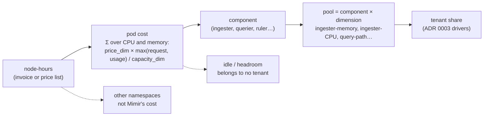

# 0006: Pricing pools on a shared cluster — from one bill to per-pool cost

**Status:** Proposed

**Takeaway: nobody is billed for "ingesters", so promcost must derive a
pool's cost from node cost, and say out loud what that derivation assumes.**
A pool is a *component × resource dimension*, idle capacity belongs to
nobody, and the figure we report is an average, not a marginal, cost.

## Context

ADR 0003 splits each pool's cost across tenants by the driver that makes
that pool grow, and takes `cost(pool)` as given — supplied by the operator
(decision 3). That is fine when someone can say "we run 8 ingesters at
€120/month". Most teams cannot: Mimir's components are pods in a shared
Kubernetes cluster, often on autoscaled (Karpenter) nodes alongside other
workloads, and the invoice is per node-hour. The split between "ingestion"
and "querying" is not something they are billed for — it is something we
infer.

Two measurements on `dev/mimir-k8s` say the inference cannot be waved
through:

- **Ingesters mostly serve reads.** Over 10 minutes: 129.5s of request time
  on `/cortex.Ingester/QueryStream` against 33.7s on `/cortex.Ingester/Push`
  — about 79% reads on a rule-heavy workload. ADR 0003's pool 2 calls
  ingester CPU the *write path*, driven by samples ingested. For CPU that is
  wrong; for memory it is right.
- **Time is contaminated by neighbours.** When one tenant's expensive rules
  ran, an untouched tenant's query time doubled (25.4s → 58.4s) while the
  data it fetched did not move.



## Decisions

### 1. A pool is a component × resource dimension, not a component

One node-hour pays for CPU and memory together, but a component's two
dimensions are driven by different tenant behaviour and move independently.
Ingester memory is driven by active series; ingester CPU is driven by
requests, most of them reads. Keeping them as one pool forces a single
driver onto two unrelated costs.

This **corrects ADR 0003 pools 1 and 2**: pool 1 stays ingester *memory*
with active series as its driver; ingester *CPU* becomes its own pool, and
is no longer described as the write path.

### 2. Ingester CPU is split by route, not assumed

`cortex_request_duration_seconds_sum{job=~".*ingester", route}` already
separates `Push` from `QueryStream`. The push fraction is attributed by
samples received (ADR 0003 pool 2's driver), the query fraction by data
fetched, beside pool 6. The split is measured per window, not fixed: it is a
property of the workload, and 79/21 on a rule-heavy rig is not a constant to
hard-code.

### 3. Pod cost on a shared cluster

For each pod, over its lifetime in the window:

```
pod_cost = Σ over {cpu, memory} of
           node_price_dim × max(request, usage)_dim / node_capacity_dim
```

`max(request, usage)` because a reservation costs money whether or not it is
used, and usage above a request is real consumption. The per-dimension price
split comes from the instance type. Sources, in preference order:

1. the operator inventory ADR 0003 decision 3 defines (a pool price, or
   per-component replica counts and prices);
2. an OpenCost/Kubecost adapter, which already prices pods this way;
3. node prices plus the Kubernetes API, computed by promcost.

Nothing here is guessed: with no source, the pool is **not costed** (ADR
0003 decision 3), exactly as today.

### 4. Idle capacity belongs to nobody

A cluster kept at 40% utilisation for headroom has cost that no tenant
caused. Spreading it across tenants inflates every share and makes the
number indefensible in the conversation it exists for. Idle is reported as
its own line — *"31% of Mimir's node cost was unallocated headroom"* — and
tenant shares are shares of the allocated remainder. Non-Mimir namespaces
are outside the calculation entirely.

### 5. We report average cost, and say which it is

Under autoscaling, a tenant's *marginal* cost (would removing it remove a
node?) is not its *average* cost (its share of what the nodes cost now).
Chargeback needs the average; capacity planning needs the marginal; a
report that does not say which one it shows will be used for the wrong
question. promcost reports average cost and labels it. Marginal cost is a
later, separate question — it needs node-level bin-packing, not a share.

### 6. Reconciliation is a standing check

For any window, Σ (pool costs) + idle must equal the node cost attributed to
Mimir's namespace. The report should be able to print that identity, because
it is the one check that catches an arithmetic or coverage mistake in
everything above. It is also how a billing export earns its place: to
**check** the model, never to fit it (ADR 0004 decision 2).

## Consequences

- **The inventory grows a second shape.** Besides "8 ingesters at €120", an
  operator can give node prices and let promcost derive pool costs. Both
  must produce the same report, with different assumption trails.
- **Three numbers must be shown together** for a cross-pool figure to mean
  anything: the tenant's share, the priced fraction of pools (ADR 0003
  `[A]`), and the idle fraction. Two of the three are new.
- **Some pools are cheap to price and some are not.** Components with a
  stable replica count price well; anything scaled by an autoscaler needs
  pod-hours rather than a replica count, which is why decision 3 is
  expressed per pod and per window.
- **Fixed cost gets shared out by the driver, silently.** A pool's cost is
  part fixed (a Go runtime, caches and WAL buffers exist at zero series)
  and part variable. Splitting the whole pool by one driver charges every
  tenant a pro-rata slice of the fixed part, which is fine for chargeback
  and wrong for "what would we save by removing this tenant" — the same
  average-versus-marginal distinction as decision 5, one level down.
- **The mappings need calibration, not assertion** — ADR 0003 decision 6
  said so; this ADR is what makes it testable, since a pool now names a
  resource dimension that can be measured directly per pod.

## Open questions

- Spot and on-demand mixes: one node price per instance type is a
  simplification a real bill will contradict.
- Node lifetime under Karpenter: pods move, and a pod-hour on a node that
  existed for nine minutes is not priced like one on a reserved node.
- Whether store-gateway and compactor deserve the same dimensional split, or
  whether a single dimension dominates each.

## How this gets tested

Not by argument — `dev/mimir-k8s` exists for this:

| experiment | tests | expected |
|---|---|---|
| OpenCost cross-check (`make opencost`) | decision 3's pod-cost formula | per-component agreement within a few % |
| E1 — step query load at constant ingestion | decisions 1 and 2 | ingester CPU tracks query volume; route split moves with it |
| E2 — sweep active series 10k→60k | ADR 0003 pool 1's driver | memory vs series fits a line (R² > 0.95); slope is the KB/series coefficient |
| E3 — step query load | pool 6's driver | bytes fetched predicts querier CPU better than query seconds do |

First results (`dev/mimir-k8s`, 2026-09-21): E2 fits **3.15 KiB of ingester
working set per raw active series, R² 0.996**, on top of **531 MiB that is
fixed across three ingesters**. So pool 1's driver holds — and roughly 40%
of ingester memory at that scale is fixed cost, which a per-series share
spreads across tenants pro rata. That is a defensible choice and a choice
nonetheless; see the consequence below.

## References

- [ADR 0003](0003-cost-model-pool-driver-mappings.md) — the cost model this
  prices; decisions 3 and 6, and the pool 1/2 rows corrected here
- [ADR 0004](0004-finops-pivot-scope-and-sequencing.md) — decision 2
  (OpenCost adapter, billing exports as a check, no fitted weights)
- `dev/mimir-k8s/README.md` — the rig, its scenarios, and the measurements
  quoted above
- GitHub issues #34 (multi-process calibration rig) and #10 (validating
  attribution against infrastructure metrics)
